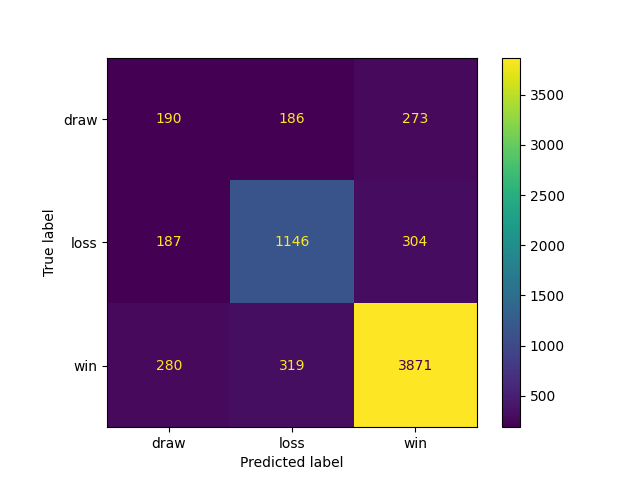
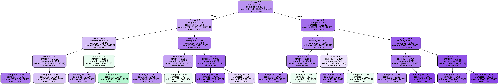

# Connect-4 Decision tree

## How to use:

### Prerequisites

>Download Python compiler

>Install pip
```
pip install graphviz sklearn matplotlib
```
```
sudo apt-get install graphviz
```

### To run:
```
make
```
or
```
python3 main.py
```

### To clean cache:
```
make clean
```

# Assignment requirements

### Source code overview:
```
├── main.py
├── connect4.data
├── DataCenter
│   ├── index.py
│   ├── tree
│   │   ├── '''image for decision tree'''
│   │   └── ...
│   ├── matrix
│   │   ├── '''image for confusion matrix'''
│   │   └── ...
│   ├── text
│   │   ├── feature_test_40_60.dat
│   │   ├── feature_test_60_40.dat
│   │   ├── feature_test_80_20.dat
│   │   ├── feature_test_90_10.dat
│   │   ├── feature_train_40_60.dat
│   │   ├── feature_train_60_40.dat
│   │   ├── feature_train_80_20.dat
│   │   ├── feature_train_90_10.dat
│   │   ├── label_test_40_60.dat
│   │   ├── label_test_60_40.dat
│   │   ├── label_test_80_20.dat
│   │   ├── label_test_90_10.dat 
│   │   ├── label_train_40_60.dat 
│   │   ├── label_train_60_40.dat 
│   │   ├── label_train_80_20.dat 
│   │   └── label_train_90_10.dat
├── State
│   └── index.py
└── Machine
    └── index.py
```

## Preparing the datasets

> ### DataCenter
> Read data from connect4.data and seperate according to ratio respectively ((`train/test`) `40/60`, `60/40`, `80/20`, and `90/10`)
> <br> After prepare train and test data. I read lines by lines and convert to form `State`


## Building the decision tree classifiers

> ### State
> This class will convert ['b','x','o'] to ['0','-1','1'] and save to state, ['win','lose','draw'] is saved to result 

```
state: [
    0, 0, 0, 0, 0, 0, 0, 
    0, 0, 0, 0, 0, 1, 0, 
    0, 0, 0, 0, -1, 1, -1, 
    1, -1, 0, -1, 1, 0, 0, 
    0, 0, 0, 0, 0, 0, 0, 
    0, 0, 0, 0, 0, 0, 0
]
result: "draw"
```

> ### Machine
```python
class Machine
    #you can provide ratio and max depth for the machine
    def __init__(self,ratio=[90,10],maxDepth = None):

    # First, let the machine training itself
    def train(self):

    # Second, machine perform test 
    def test(self):

    # you can plot confusion matrix to statistic
    def plotConfusionMatrix(self):

    # or draw decision tree to illustrate the process    
    def drawDecisionTree(self):
```

## Evaluating the decision tree classifiers


- [x] Train/Test is 40/60 with max_depth = 32 (auto)
    - ### Confusion Matrix: 
    - ### Classification Report: 
        |                 | precision     |  recall   | f1-score      | support |
        | ------------    | ---------     | --------- | ------------  | ------  |
        |  draw           |     0.26      |    0.27   |     0.26      |   3811  |
        |  loss           |     0.65      |    0.65   |     0.65      |   9977  |
        |  win            |     0.85      |    0.84   |     0.84      |  26747  |
        | accuracy        |               |           |     0.74      |  40535  |
        | macro avg       |     0.58      |    0.59   |     0.59      |  40535  |
        | weighted avg    |     0.74      |    0.74   |     0.74      |  40535  |   

- [x] Train/Test is 60/40 with max_depth = 35 (auto)
    - ### Confusion Matrix: 
    - ### Classification Report: 
        |                 | precision     |  recall   | f1-score      | support |
        | ------------    | ---------     | --------- | ------------  | ------  |
        |  draw           |     0.27      |    0.26   |     0.27      |   2546  |
        |  loss           |     0.66      |    0.67   |     0.67      |   6597  |
        |  win            |     0.86      |    0.86   |     0.86      |  17880  |
        | accuracy        |               |           |     0.76      |  27023  |
        | macro avg       |     0.60      |    0.60   |     0.60      |  27023  |
        | weighted avg    |     0.75      |    0.76   |     0.76      |  27023  |   

- [x] Train/Test is 80/20 with max_depth = 34 (auto)
    - ### Confusion Matrix: 
    - ### Classification Report: 
        |                 | precision     |  recall   | f1-score      | support |
        | ------------    | ---------     | --------- | ------------  | ------  |
        |  draw           |     0.28      |    0.27   |     0.28      |   1239  |
        |  loss           |     0.68      |    0.86   |     0.68      |   3302  |
        |  win            |     0.86      |    0.86   |     0.86      |   8971  |
        | accuracy        |               |           |     0.76      |  13512  |
        | macro avg       |     0.61      |    0.60   |     0.60      |  13512  |
        | weighted avg    |     0.76      |    0.76   |     0.76      |  13512  |    

- [x] Train/Test is 90/10 with max_depth = 37 (auto)
    - ### Confusion Matrix: 
    - ### Classification Report: 
        |                 | precision     |  recall   | f1-score      | support |
        | ------------    | ---------     | --------- | ------------  | ------  |
        |  draw           |     0.31      |    0.28   |     0.29      |    641  |
        |  loss           |     0.70      |    0.71   |     0.70      |   1646  |
        |  win            |     0.86      |    0.87   |     0.87      |   4469  |
        | accuracy        |               |           |     0.77      |   6756  |
        | macro avg       |     0.62      |    0.62   |     0.62      |   6756  |
        | weighted avg    |     0.77      |    0.77   |     0.77      |   6756  |                     


> Interpret for Classification Report: it point out that the `precision` corresponding to the `label draw, loss, win`. <br>
> Inrerpret for Confusion Matrix: row and column is actual and predicted label respectively. 
> At `[win][win]`, `[loss][loss]`, `[draw,draw]` we have true predicted label.
- [x] Comment: if `max_depth` of decision tree is set to None, the nodes are expanded until all leaves are pure. 
This is the reason for auto max_depth is always greater than `30`. 
Besides, our decision tree classifiers predict the `win` label more precise 
than other label because the training data have most `win` label (always account for greater than 60 percent in total labels). 


## The depth and accuracy of a decision tree
> This task works on the 80/20 training set and test set

- [x] Decision Tree
    - ### Max depth = None 
    - ### Max depth = 2 
    - ### Max depth = 3 
    - ### Max depth = 4 
    - ### Max depth = 5 
    - ### Max depth = 6 
    - ### Max depth = 7 


- [x] Accuracy table
    | max_depth | None  | 2     | 3     | 4     | 5     | 6     | 7     |
    | --------- | ----- | ----- | ----- | ----- | ----- | ----- | ----- |
    | accuracy  | 0.77 | 0.67 | 0.69 |  0.69 | 0.70 | 0.72 | 0.72 |

- [x] Comment: the `accuracy` increase proportionally to the `max_depth`. 
The higher the `max_depth` is, the higher the `accuracy` is. 
A high `max_depth` is suggested if we expect a high accuracy, 


## Grading

| No    | Specifications                             | Scores (%) | Complete (%) |
| ----- | ------------------------------------------ | ---------- | ------------ |
| 1     | Preparing the datasets                     | 20         | 100          |
| 2     | Building the decision tree classifiers     | 20         | 100          |
| 3     | Evaluating the decision tree classifiers   |            |              |
|       | Classification report and confusion matrix | 20         | 100          |
|       | Comments                                   | 10         | 100          |
| 4     | The depth and accuracy of a decision tree  |            |              |
|       | Trees, tables, and charts                  | 20         | 100          |
|       | Comments                                   | 10         | 100          |
| Total |                                            | 100        | 100          |

References
- [1] Scikit-learn decision trees: https://scikit-learn.org/stable/modules/tree.html
- [2] Tutorial: https://github.com/lamnguyen5464/Connect-4-decicion-tree
- [3] How to use sklearn.tree: https://scikit-learn.org/stable/modules/generated/sklearn.tree.DecisionTreeClassifier.html#sklearn.tree.DecisionTreeClassifier
- [4] How to use sklearn.metric: https://scikit-learn.org/stable/modules/generated/sklearn.metrics.classification_report.html#sklearn.metrics.classification_report


